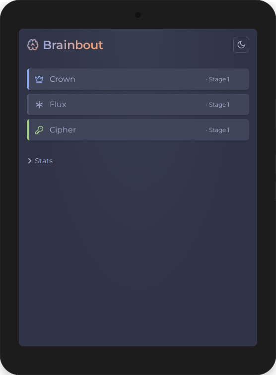

# Brainbout

[](https://github.com/kimhamberg/brainbout/actions/workflows/ci.yml)

A Chess960 sparring partner. Train your brain, not your scroll thumb.

Play Fischer Random chess against Stockfish locally — in your browser, as a desktop app, or on Android. All 960 starting positions, adjustable difficulty, no internet required.

**[Play online](https://kimhamberg.github.io/brainbout/)**



## Requirements

- [Node.js](https://nodejs.org) 20+
- [Go](https://go.dev) 1.23+ (desktop builds only)
- [Android SDK](https://developer.android.com/studio) + [Gradle](https://gradle.org) (Android builds only)

## Quick start

```
npm install
make dev
```

## Build

| Target  | Command              | Output                       |
| ------- | -------------------- | ---------------------------- |
| Dev     | `make dev`           | `localhost:5173`             |
| Desktop | `make build-server`  | `chess960`                   |
| Linux   | `make build-linux`   | `chess960-linux-amd64`       |
| Windows | `make build-windows` | `chess960-windows-amd64.exe` |
| Android | `make build-android` | `app-debug.apk`              |
| Clean   | `make clean`         |                              |

The desktop build embeds all web assets into a single binary — no runtime dependencies.

## Lint

```
make lint
```

Runs ESLint (TypeScript), Stylelint (CSS), staticcheck + go vet (Go), ktlint (Kotlin), and Prettier (all files).

## Tests

```
npm test
```

31 tests covering position generation, engine UCI parsing, and game state logic.

## Stack

- [Chessground](https://github.com/lichess-org/chessground) — board UI
- [chessops](https://github.com/niklasf/chessops) — Chess960 move validation
- [Stockfish WASM](https://www.npmjs.com/package/stockfish) — engine, single-threaded, runs locally
- [Vite](https://vite.dev) — build tooling
- [Go](https://go.dev) — desktop server (single binary with embedded assets)
- [Kotlin](https://kotlinlang.org) + [Android WebView](https://developer.android.com/develop/ui/views/layout/webapps/webview) — mobile wrapper

## License

[GPL-3.0](LICENSE)
