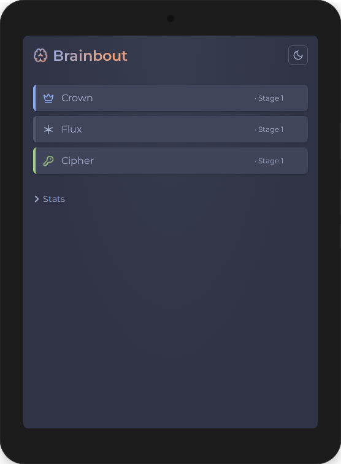

<p align="center">
  
</p>

<h1 align="center">Brainbout</h1>

<p align="center">
  <a href="https://github.com/kimhamberg/brainbout/actions/workflows/ci.yml"></a>
  <a href="LICENSE"></a>
  <a href="https://kimhamberg.github.io/brainbout/"></a>
  <a href="https://github.com/kimhamberg/brainbout/releases/latest/download/brainbout-linux-amd64"></a>
  <a href="https://github.com/kimhamberg/brainbout/releases/latest/download/brainbout-windows-amd64.exe"></a>
  <a href="https://github.com/kimhamberg/brainbout/releases/latest/download/brainbout.apk"></a>
</p>

A daily brain workout. Train your brain, not your thumb scroll. No accounts, no ads, no internet required. Progress tracked locally.

-  **Crown** — Chess960 vs Stockfish (ends on checkmate / resign / clock flag)
-  **Flux** — adaptive rule-switching with inhibition (5 HP, lose HP on misses)
-  **Lex** — spaced-repetition vocabulary (30-word session, Anki-style)

No time limits — every session has a natural end state. Nothing greys out.

<p align="center"></p>

## Requirements

- [Bun](https://bun.sh) 1.3+
- [Android SDK](https://developer.android.com/studio) + [Gradle](https://gradle.org) (Android builds only)

## Quick start

```
bun install
bun run dev
```

## Build

| Target  | Command                  | Output                        |
| :------ | :----------------------- | :---------------------------- |
| Dev     | `bun run dev`            | `localhost:5173`              |
| Desktop | `bun run build:server`   | `brainbout`                   |
| Linux   | `bun run build:linux`    | `brainbout-linux-amd64`       |
| Windows | `bun run build:windows`  | `brainbout-windows-amd64.exe` |
| Android | `bun run build:android`  | `app-debug.apk`               |
| Clean   | `bun run clean`          |                               |

The desktop build embeds all web assets into a single binary — no runtime dependencies.

## Lint

```
bun run lint
```

Runs Biome (TS/JS/JSON), Stylelint (CSS), ktlint (Kotlin), SuperHTML (HTML), actionlint (CI), and taplo (TOML).

## Tests

```
bun test            # unit + happy-dom DOM tests
bun run test:e2e    # Playwright nav/UI smoke (Chromium + reduced-motion)
bun run test:fuzz   # fast-check at 100k runs
bun run test:mutation  # Stryker mutation testing
```

Unit tests cover position generation, chess clock, cognitive games, engine parsing, timer, progress tracking, and hub render. E2E covers hub → game navigation, deep links, theme persistence, back-nav, and asserts zero console errors / failed requests.

## Sound

20 synthesized sounds (modal wood synthesis for chess pieces, FM bells, additive warm tones). Generator lives in a separate offline tool — see `brainbout-sounds/`. Output WAVs are committed to `public/sounds/`.

## Stack

- [Chessground](https://github.com/lichess-org/chessground) — board UI
- [chessops](https://github.com/niklasf/chessops) — Chess960 move validation
- [Stockfish WASM](https://github.com/nicfab/stockfish.wasm) — chess engine
- [Catppuccin](https://github.com/catppuccin/catppuccin) — color theme (Frappe dark / Latte light)
- [Lucide](https://lucide.dev) — icons
- [Bun](https://bun.sh) — desktop server compiled to a single binary with embedded assets
- [Kotlin](https://kotlinlang.org) + [Android WebView](https://developer.android.com/develop/ui/views/layout/webapps/webview) — mobile wrapper

## Research

Each game targets a cognitive domain with peer-reviewed evidence behind it. The evidence varies in strength — spaced repetition is among the most replicated findings in psychology, while chess transfer claims face serious methodological challenges.

**Flux — task switching & inhibitory control**

Flux combines cued task switching with go/no-go inhibition. These target two of the three core executive functions identified by [Diamond (2013)](https://doi.org/10.1146/annurev-psych-113011-143750): cognitive flexibility and inhibitory control. Task switching produces a measurable "switch cost" — slower, more error-prone responses after a rule change — that reflects the time needed to reconfigure mental resources [(Monsell, 2003)](<https://doi.org/10.1016/S1364-6613(03)00028-7>). Go/no-go training produces immediate cognitive gains, but a meta-analysis found that go/no-go training alone does not sustain long-term benefits in healthy adults; combining it with other paradigms does [(Li et al., 2022)](https://doi.org/10.3389/fnins.2022.813975).

**Crown — chess**

A prospective cohort study of 469 adults over 75 in the _New England Journal of Medicine_ found that cognitively stimulating leisure activities — including board games — were associated with reduced dementia risk (HR 0.93 per point of cognitive activity), while physical activities were not [(Verghese et al., 2003)](https://doi.org/10.1056/NEJMoa022252). A meta-analysis of 24 studies found chess instruction modestly improves mathematics (d = 0.38) and cognition (d = 0.34) in school-age children [(Sala et al., 2017)](https://doi.org/10.3389/fpsyg.2017.00238). However, the same authors found that these effects drop to near zero when studies use active control groups, and far transfer from chess to unrelated cognitive domains has not been reliably demonstrated [(Sala & Gobet, 2017)](https://doi.org/10.1177/0963721417712760).

**Lex — spaced repetition**

The spacing effect is one of the most robust findings in memory research, first demonstrated by Ebbinghaus (1885) and [replicated 130 years later](https://doi.org/10.1371/journal.pone.0120644) with comparable results (Murre & Dros, 2015). A meta-analysis of 317 experiments across 184 articles confirmed that distributed practice produces stronger retention than massed practice, with optimal inter-study intervals scaling with the target retention interval [(Cepeda et al., 2006)](https://doi.org/10.1037/0033-2909.132.3.354). At the neural level, spacing increases pattern similarity in the ventromedial prefrontal cortex across repetitions, and irregular spacing outperforms uniform intervals — a prediction from computational models validated experimentally [(Smolen et al., 2016)](https://doi.org/10.1038/nrn.2015.18).

## Contributing

Contributions are welcome. Please open an issue first to discuss what you'd like to change.

## License

[GPL-3.0](LICENSE)
